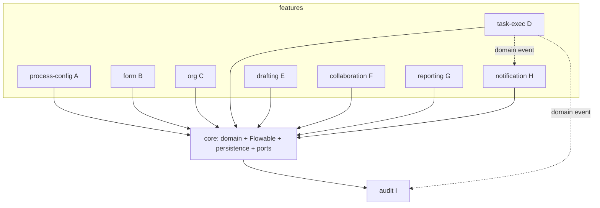
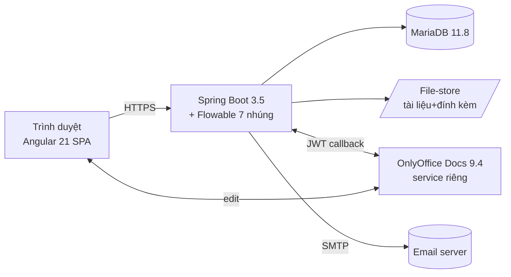
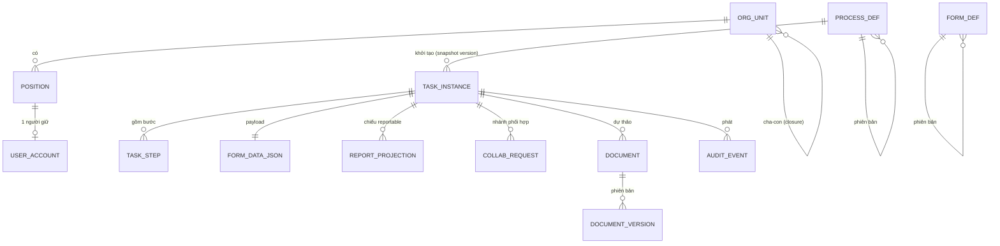

# Architecture Spine — BPM Platform

## Design Paradigm

**Modular monolith** triển khai như một deployable Spring Boot duy nhất, tổ chức **layered** (api → application → domain → infrastructure) với **hexagonal ports** cho mọi hệ thống ngoài (OnlyOffice, email/SMTP, file-store). Runtime là **metadata-driven**: quy trình và form là *dữ liệu cấu hình có phiên bản*, không phải code — engine BPMN (Flowable, nhúng) thực thi chúng.

Ánh xạ layer → package (`com.bpm`):

```text
api            → REST controller, DTO, mapping, auth filter
application    → use-case/service, điều phối giao dịch, publish domain event
domain         → entity nghiệp vụ, quy tắc bất biến, port interface
infrastructure → JPA repo, Flowable, adapter OnlyOffice/email/file-store, projection writer
```

## Invariants & Rules

### AD-1 — Modular monolith on-prem `[ADOPTED]`
- **Binds:** all
- **Prevents:** phân rã microservices sớm gây gánh nặng vận hành cho quy mô 100–500 user.
- **Rule:** Một deployable BE (Spring Boot) + Angular SPA + MariaDB + Flowable **nhúng trong tiến trình BE**. OnlyOffice Document Server là service riêng (lý do AGPL + tài nguyên). Không tách service khác ở GĐ1.

### AD-2 — Flowable là nguồn sự thật duy nhất cho trạng thái thực thi
- **Binds:** FR-A, FR-D, FR-F
- **Prevents:** hai engine trạng thái quy trình phân kỳ.
- **Rule:** Mọi trạng thái thực thi (process instance, token, định tuyến task, gateway, join) do **Flowable** sở hữu. Cấm tự xây state machine song song. Trạng thái nghiệp vụ hiển thị (nhóm D) là *phép chiếu* từ Flowable + bảng task của app, không phải nguồn độc lập.

### AD-3 — Đồng-tồn-tại phiên bản qua snapshot bất biến
- **Binds:** FR-A06, FR-B09, FR-F
- **Prevents:** sửa định nghĩa process/form làm vỡ instance đang chạy; tranh chấp "phiên bản nào áp dụng"; sub-task phối hợp sinh runtime không có version.
- **Rule:** Định nghĩa **process** và **form** là **bất biến + có version**. Instance snapshot `processDefinitionId` lúc khởi tạo. **Mọi node tạo form-binding** — kể cả sub-task phối hợp (FR-F02) sinh giữa chừng — phải **snapshot `formDefinitionVersionId` tại thời điểm node được instantiate**, không chỉ tại instance-init. Runtime resolve **luôn theo phiên bản đã snapshot**; instance mới dùng bản publish mới nhất. Nhiều phiên bản chạy song song là bình thường.

### AD-4 — Lưu form động hybrid; báo cáo chỉ đọc bảng chiếu
- **Binds:** FR-B, FR-G, NFR-10, NFR-12
- **Prevents:** báo cáo truy vấn JSON đường nóng (chậm); mỗi form lưu một kiểu khác nhau.
- **Rule:** Payload form lưu **JSON column** trên bản ghi instance/task. Trường gắn cờ `reportable` được chiếu sang bảng quan hệ có chỉ mục (projection) bởi **một `ProjectionWriter` duy nhất**, **đồng bộ trong CÙNG giao dịch** với write JSON (cấm async ở GĐ1 → không lệch sau crash, đáp ứng FR-G06 ≤5s). Báo cáo nhóm G **chỉ đọc projection**, không query JSON đường nóng. Có job reconcile phát hiện lệch JSON↔projection.

### AD-5 — "Quá hạn" là cờ trực giao, không phải trạng thái
- **Binds:** FR-D03, FR-D07
- **Prevents:** quá hạn ghi đè mất trạng thái nghiệp vụ; méo metric trễ hạn.
- **Rule:** Enum trạng thái task = `{CHO_PHE_DUYET, DANG_XU_LY, DA_HOAN_THANH, HUY}`. `overdue` là **cột projection boolean được materialize có chỉ mục**, cập nhật bởi **một scheduler + event on-deadline-change** (gồm gia hạn duyệt FR-D07 → gỡ cờ); reporting đọc cột này, **không tự tính on-the-fly** (tránh lệch metric). Lịch sử từng-quá-hạn lưu ở audit.

### AD-6 — Audit append-only, một cổng ghi, phân vùng thời gian
- **Binds:** FR-I01, FR-I02, NFR-13
- **Prevents:** ghi audit rải rác, audit khả biến, bảng audit phình làm chậm.
- **Rule:** Một bảng audit **ghi-một-lần** (không UPDATE/DELETE), **phân vùng theo thời gian**. Mọi thay đổi trạng thái/dữ liệu phát audit event qua **một `AuditPort` duy nhất** ở tầng application. Không feature nào ghi thẳng audit. **Bảng history của Flowable (`ACT_HI_*`) KHÔNG phải audit hợp lệ** — chỉ phục vụ engine; mọi vết cho FR-I (gồm vết phê duyệt FR-I02) phải đi qua AuditPort.

### AD-7 — Org là cây độ sâu tùy ý; vị trí là đơn vị phân công; snapshot người khi giao
- **Binds:** FR-C
- **Prevents:** biểu diễn org phân kỳ; mơ hồ "việc về tay ai".
- **Rule:** Cây org lưu **closure-table** (truy vấn tổ tiên/hậu duệ O(1) join). **Vị trí/chức danh** là đơn vị phân công (late-binding → người đang giữ); **mỗi vị trí một người tại một thời điểm**. Khi giao việc, **snapshot người được resolve** vào task; đổi cơ cấu sau đó không cướp việc đang chạy (FR-C05). Vị trí trống khi việc mới tới → hàng đợi "chưa có người" + cảnh báo (FR-C08), không mất việc.

### AD-8 — OnlyOffice sau cổng adapter; app sở hữu tài liệu
- **Binds:** FR-E01, FR-E08
- **Prevents:** ràng buộc vòng đời tài liệu/versioning vào editor bên thứ ba.
- **Rule:** Document Server là service ngoài, gọi qua **`DocumentEditorPort`** theo hợp đồng **JWT callback**. **App sở hữu** lưu trữ binary tài liệu + lịch sử phiên bản (AD-11); OnlyOffice chỉ là bề mặt soạn thảo. Lưu version qua callback của editor vào kho của app.

### AD-9 — Xác thực nội bộ; RBAC qua vị trí→vai trò
- **Binds:** FR-C06, FR-C07
- **Prevents:** rò rỉ phân quyền; phụ thuộc hạ tầng SSO chưa có.
- **Rule:** GĐ1 **tài khoản nội bộ** (không SSO/AD), phiên/token. Quyền **resolve qua vị trí → vai trò**, không gán quyền trực tiếp cho người. Kiến trúc auth tách rời để GĐ sau cắm SSO không sửa lõi.

### AD-10 — Một outbound notification port, kênh cắm-được
- **Binds:** FR-H
- **Prevents:** logic thông báo rải rác khắp feature.
- **Rule:** Sự kiện nghiệp vụ publish **một lần**; **`NotificationPort`** fan-out ra kênh (in-app, email) cấu hình bật/tắt theo loại sự kiện. Feature không gọi email/SMTP trực tiếp.

### AD-11 — Backup nhất quán đa kho
- **Binds:** NFR-11
- **Prevents:** tài liệu và metadata lệch nhau sau phục hồi.
- **Rule:** Binary tài liệu lưu ở **file-store có tham chiếu giao dịch trong DB**; backup **phối hợp cùng điểm thời gian** giữa MariaDB và file-store (snapshot nhất quán). Tham chiếu mồ côi/file mồ côi phải phát hiện được.

### AD-12 — Chiều phụ thuộc: feature → core, không feature ↔ feature
- **Binds:** all
- **Prevents:** hai feature build độc lập coupling không tương thích.
- **Rule:** Feature module chỉ phụ thuộc **vào trong** `core` dùng chung (domain + Flowable + persistence + port). Giao tiếp chéo feature **chỉ qua domain event hoặc port của core**, không import trực tiếp package của feature khác.

### AD-13 — Trạng thái nghiệp vụ là projection thuần từ Flowable
- **Binds:** FR-D03, FR-D, FR-F
- **Prevents:** hai nguồn ghi trạng thái (Flowable vs collaboration service) phân kỳ.
- **Rule:** Enum trạng thái (AD-5) là **projection thuần**, **chỉ một `StatusProjectionWriter`** ghi, dẫn xuất từ **Flowable execution/task-listener**. Không service nghiệp vụ nào (kể cả collaboration) set trạng thái trực tiếp — chúng chỉ tác động qua hành động Flowable (complete/cancel), trạng thái suy ra từ engine.

### AD-14 — App là nguồn sự thật cho phân công; Flowable assignee chỉ mirror
- **Binds:** FR-C03, FR-C04, FR-C05, FR-C08
- **Prevents:** hai chủ sở hữu "việc về tay ai" (Flowable `ASSIGNEE_` vs snapshot app) lệch nhau.
- **Rule:** Bảng app `TASK_ASSIGNMENT` (snapshot người + vị trí lúc giao) là **nguồn sự thật**; Flowable assignee chỉ **mirror**, set qua **một `AssignmentPort`**. Mọi uỷ quyền/chuyển tiếp/thay thế (FR-C04) và reassign đi qua port đó, ghi **app + Flowable trong một giao dịch**. **Vị trí trống (FR-C08):** set Flowable candidate-group = đơn vị + cờ app `UNASSIGNED`; **không bao giờ** để task thiếu cả assignee lẫn candidate (tránh task biến mất khỏi mọi inbox).

### AD-15 — Cancel cascade chỉ qua Flowable
- **Binds:** FR-D10, FR-F
- **Prevents:** double-close hoặc token join treo khi app xoá nhánh ngoài engine.
- **Rule:** Hủy task cha có nhánh con (FR-D10) thực thi **DUY NHẤT qua Flowable** (delete execution/instance) → **execution-listener phát event** đóng `COLLAB_REQUEST` + gỡ inbox + audit. App **không tự xoá nhánh phối hợp ngoài engine**.



## Consistency Conventions

| Concern | Convention |
| --- | --- |
| Naming | Entity/bảng `snake_case`; class Java `PascalCase`; REST path `/api/v1/{resource}` kebab; event `DomainThing+PastTense` (vd `TaskAssigned`). |
| Định danh | Khóa chính **UUID v7** (sắp xếp theo thời gian) cho entity nghiệp vụ; id Flowable giữ nguyên định dạng Flowable. |
| Ngày/giờ | Lưu **UTC**, kiểu `TIMESTAMP`; truyền API **ISO 8601** có offset; hiển thị theo giờ VN ở FE. |
| Lỗi | Envelope lỗi REST thống nhất `{ code, message, details[], traceId }`; HTTP status chuẩn. |
| Trạng thái & cross-cutting | Mutation đi qua application service trong **một giao dịch**; audit phát qua `AuditPort` (AD-6); log có `traceId`; cấu hình qua Spring profile; auth qua filter resolve vị trí→vai trò (AD-9). |
| Form/process definition | Bất biến + versioned (AD-3); thay đổi = publish phiên bản mới, không sửa tại chỗ. |

## Stack

| Name | Version |
| --- | --- |
| Java | 21 (LTS) |
| Spring Boot | 3.5.x |
| Flowable (embedded BPMN engine) | 7.x |
| Angular | 21 (LTS) |
| MariaDB | 11.8 (LTS) |
| OnlyOffice Docs Community | 9.4+ (AGPL v3 — không còn giới hạn 20 kết nối) |

> Spring Boot 3.5.x (không phải 4.1) vì Flowable 7 build cho dòng Spring Boot 3; ưu tiên ổn định on-prem. Angular 21 LTS (không phải 22) vì vòng đời bảo trì dài. Xem memlog cho lý do.

## Structural Seed

**Container view (triển khai on-prem):**



**Core entity ERD (tên + quan hệ; thuộc tính là invariant nằm ở AD):**



**Source tree tối thiểu:**

```text
bpm-platform/
  backend/                 # Spring Boot 3.5 + Flowable 7
    api/                   # controller, dto
    application/           # use-case service, transaction, event publish
    domain/                # entity, rule bất biến, port interface
    infrastructure/        # jpa, flowable cfg, adapter (onlyoffice/email/file), projection writer
    resources/processes/   # BPMN seed (quy trình mẫu #1)
  frontend/                # Angular 21 SPA
    process-designer/      # canvas kéo-thả (bpmn-js)
    form-builder/          # form động kéo-thả
    task-inbox/  dashboard/  org-admin/
  deploy/                  # docker-compose: be, mariadb, onlyoffice; script backup nhất quán
```

## Capability → Architecture Map

| Nhóm năng lực (PRD) | Lives in | Governed by |
| --- | --- | --- |
| A. Cấu hình quy trình | `process-config` + Flowable | AD-2, AD-3, AD-12 |
| B. Form động | `form` + JSON/projection | AD-3, AD-4 |
| C. Org & phân công | `org` (closure-table) | AD-7, AD-9 |
| D. Thực thi nhiệm vụ | `task-exec` (chiếu từ Flowable) | AD-2, AD-5 |
| E. Soạn thảo & ý kiến | `drafting` + OnlyOffice adapter | AD-8, AD-11 |
| F. Phối hợp | `collaboration` (Flowable parallel/join) | AD-2, AD-12 |
| G. Minh bạch & thống kê | `reporting` (đọc projection) | AD-4 |
| H. Thông báo | `notification` | AD-10 |
| I. Audit & lưu trữ | `audit` | AD-6, AD-11 |

## Deferred

- **C1 — trình tự giao hàng GĐ1 (lát cắt dọc vs giữ rộng):** kiến trúc trung lập — nền generic không đổi theo lựa chọn. Quyết ở bước Epics (owner PM+Architect). *Khuyến nghị Architect: nền generic từ ngày 1 (Flowable cho gần như miễn phí), giao hàng theo lát cắt dọc quy trình #1 trước.*
- **Tích hợp ĐHTN** (ký/ban hành tự động) — GĐ sau; GĐ1 ghi nhận thủ công (FR-E09). Cổng adapter để ngỏ.
- **Migration chủ động** nhiệm vụ-đang-chạy sang phiên bản mới — GĐ2 (AD-3 chỉ đảm bảo đồng-tồn-tại).
- **SSO/AD** — GĐ sau (AD-9 đã tách auth).
- **Phân vùng/chiến lược scale báo cáo nâng cao, cache** — code sở hữu khi chạm ngưỡng thực tế.
- **Lưu trữ đúng chuẩn 06-QC/VPTW & NĐ45 (xuất/nộp)** — GĐ sau; GĐ1 chỉ chuẩn-sẵn metadata (FR-I04).
